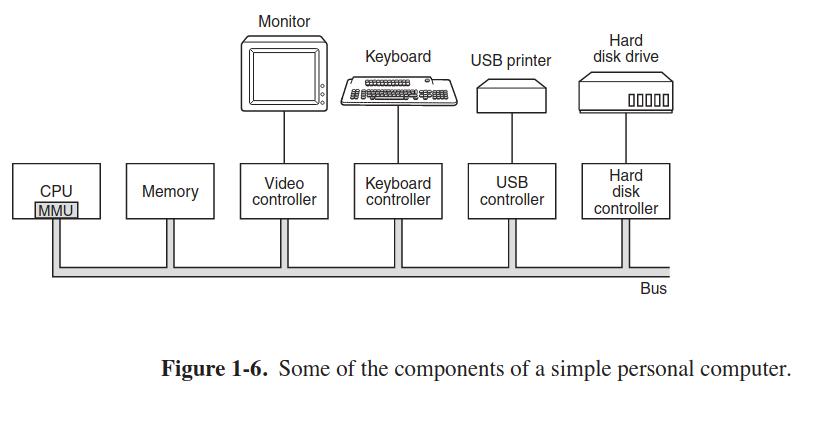

- we have bare disk. to interact with it, a programmer needs to have a disk driver (a piece of software that provides an interface for reading/writing without getting into devastating details)
- OSs provides yet another layer of abstraction for programmers: a concept of file
- OS: provides abstractions of hardware (processes, files, IO) for programmers and manages hardware
- 
- program counter is a register that contains an address in **main memory** of the next instruction to fetch and execute
- stack pointer points to the top of the current stack in memory. stack contains separate frame for each function
- PSW register contains user/kernel bit