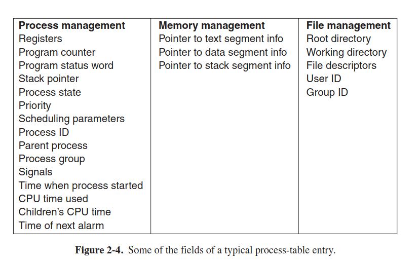
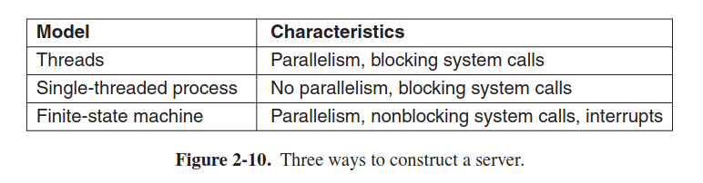
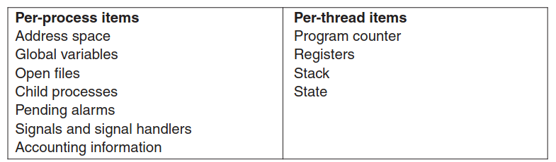
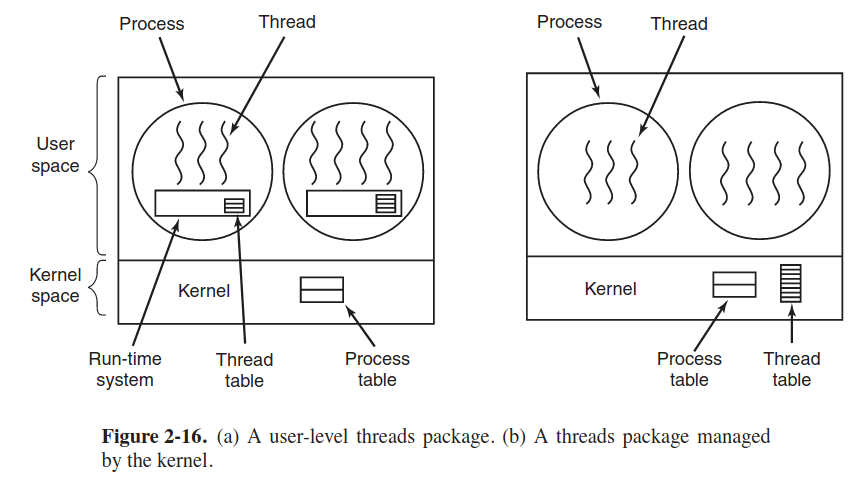
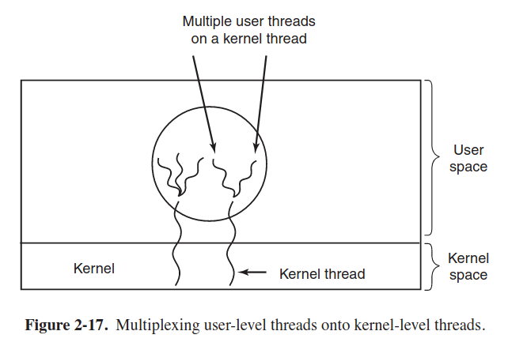

## 2.1 Processes
- true parallelism: two and more cores share a physical memory and work in parallel
- pseudo parallelism: one core works so fast that creates the illusion of running multiple programs (i.e. multiprogramming)
- each provess has its own virtual CPU but in practice there is only one physical CPU
- 4 principal events cause processes to born: system initialization, execution of a syscall that creates processes by a running process, user request to create a process
- fork creates the same process with the same process image, execve changes its memory image. but child and parent have its own distinct address spaces!
- 4 conditions for a process to die: normal exit, error exit (voluntary), fatal error (program executes an illegal instruction: referencing non-existing memory, dividing by zero), killed by another process (involuntary)
- a process and all its children form a process group. processes in UNIX cannot disinherit their children
- a process blocks for input, i.e. the process is blocked  

 
## 2.2 Threads 
- each process has a signle thread of control and an address space

### 2.2.1 Thread usage
- in some applications we need entities (like processes) but with the same address space, that's why the multiple threads of execution were invented. normal threads and I/O bound threads can overlap that yield better performance

### 2.2.2 The Classical Thread Model

- thread, as process, can be running, blocked, ready. blocked thread waits for some event to unblock it
- thread_join: the procedure blocks the calling thread until a specific thread will exit
- thread_yield: the thread yields the CPU to another thread. this is important because there is no clock interrupt as for processes

### 2.2.3 POSIX Threads
- IEEE has defined a standard for threads: PThreads.
- pthread_create/exit/join/yield
- pthread_attr_init/destroy creates the attribute structure accosiated with a thread and initializes it to default values

### 2.2.4 Threads in User Space
- put threads package entirely in user space
- the kernel knows nothing about threads, it thinks it works with ordinary single-threaded processes
- cons: 
- a user-level threads package can be implemented on an OS that does not support threads
- no blocking calls, otherwise blocking a thread would stop all threads (disaster!)
- each process needs its own private **thread table** to keep track of threads in that process

- pros:
- it is much faster, because we do not need to trap into kernel
- allows each process to have own scheduling algorithm

### 2.2.5 Threads in Kernel
- some threads can block while others can work! (the main feature is available now)

### 2.2.6 Hybrid implementations

### 2.2.7 Scheduler Activations
- kernel threads are indisruptably slower, that's why researchers have looked for other solutions, Anderson (1992) came with a solution, called Scheduler Activations
- are used to implement user-level threads (that mimic kernel threads)
- when the kernel knows that a thread has blocked, it notifies the process' run-time system, passing as parameters on the stack the info on this thread. notification is implemented at a known address. such mechanism is called an **upcall**.

### 2.2.8 Pop-up threads
- used in distributed systems (networks)
- a traditional approach is to have a thread that is blocked on *receive* system call waiting for an incoming message
- new approach is that arriving of a new message causes an thread to be created, so-called **pop-up thread**
- latency between message arrival and the start of processing tends to zero

### 2.2.9 Making Single-threaded code multithreading
- threads work badly with global variables: one thread can depend on the global variable, it checked the variable, then suddenly be disrupted by scheduler, then another thread can rewrite the global variable, the first thread is not checking the variable, starts initiating and failes
- then, there should be some solutions to prevent this:
- assign each thread its own private global variables
- huge problem is that many library procedures are **not reentrant**, we cannot switch threads one with another
- signals are very hard to manage in single-threaded code

## 2.3 IPC
- 3 issues arise (last two issues also apply to threads,and solutions to them)
1. how can one process pass information to another?
2. two or more processes do not get in each other's way
3. proper sequencing of dependent processes (if A waits for B, then firstly comes B, then A)  

### 2.3.1 Race Conditions
- two or more processes are reading or writing some shared data and the final result is depending on who runs precisely when is called **race condition**

### 2.3.2 Critical regions
- the key to preventing trouble is to find a way to prohibit more than one process from reading and writing to **shared data** on the same time, i.e. we need **mutual exclusion**.

- Mutual exclusion with busy waiting: disabling interrupts (not efficient), 

- busy waiting is continuously testing a variable until some value appears