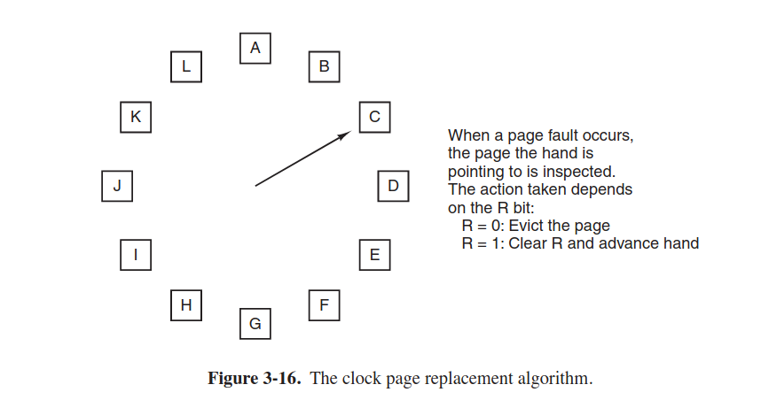

- every program just sees the physical memory
- MOV REG1,1000 (where 1000 is the memory location or cell containing some numbers of bits, usually eight)
- only one 

## 3.4 Page Replacement algorithms

### 3.4.1 The optimal page replacemnt algorithm
- each page is labeled with the number of instructions that will be executed before the page is first referenced
- this algorithm cannot be implemented, because it violates 

### 3.4.2 Not recently used algorithm
- NRU algorithm divides all pages in classes 0-3

### 3.4.3 FIFO algorithm
- there's also a modification with **second chance**

### 3.4.5 Clock algorithm

### 3.4.6 LRU
