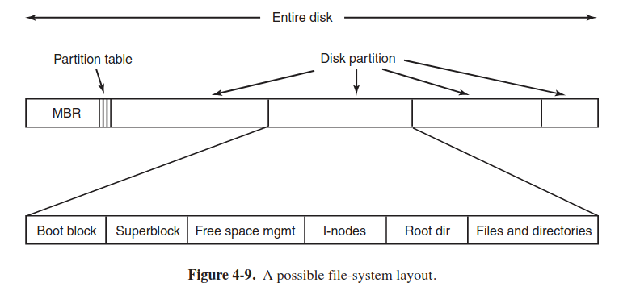
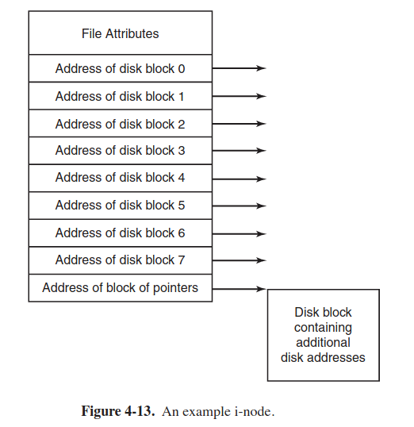
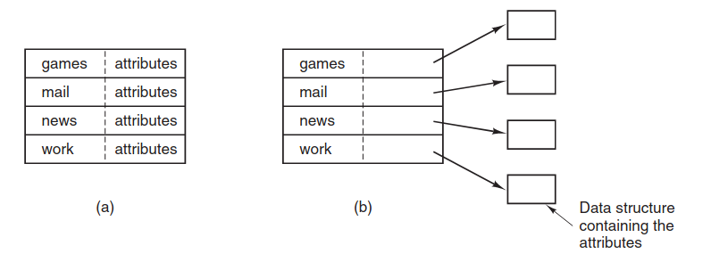
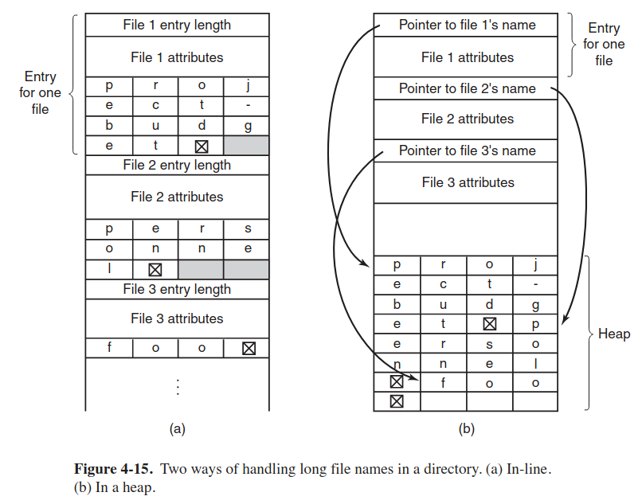

## 4. File  systems
### 4.0 Intro

- when a machine is turned off, data needs to be stored somewhere. disks are used for that purpose. also, disks offer much more space than RAM.
- disk is a sequence of blocks. each block can be read or written to.
- process is a unit of RAM, **file** is a unit of disk
- **file system** is a part of OS that manages files

### 4.1 Files
- Windows 95 used FAT-16 (MS-DOS file system), Windows 98 used FAT-32, Windows NT/2000/XP/Vista/7.. uses NTFS
- in Unix-like systems file extensions are just conventions for users and are not used/enforced by OS
- of course, various programs can insist on proper extensions, e.g. C compiler insists on .c extesion.
- a file is just a sequence of bytes (= unstructured byte streams), OS does not care about its internals (modern OS use this approach)
- files types are: regular files, directories. UNIX also has character/block special files (used to operate on hardware)
- regular files are either ASCII files (just plain text) or binary files
- let's examine internals of a UNIX binary file, it consists of header (**magic number** (identifies the file as an executable file), sizes of various file's pieces, entry point (= address at which to start the execution)), text and data of the program itself, relocation bits (used for loading in memory) and symbol table (used for debugging)
- every OS should recognize at least its own binary files
- there are two type of file access: early OS allowed a process to read file's bytes only in a **sequential** way, a process could not read them out of order (that was convenient when the storage medium was magnetic tape rather than disk).  
When disks become popular, it became possible to read file's bytes out of order, such files are called **random-accessed files**.
- *seek* command takes the initial position as an argument and start reading sequentially from it (this method is used in UNIX/Windows)
- from user's point of view a file is its data and **attributes** (i.e. **metadata**): creator, owner, protection (who can access file and in which way), read-only flag, hidden flag, system flag,archive flag (0 for has been backed up), ASCII/binary/ flag, RAM (0 for sequential access only, 1 for random access), creation time, time of last access/change, current size
- file operations: create, delete, open (a process fetch the attributes and a list of disk addresses into RAM for rapid access on later calls), close, read, write, append, seek (for random-access files, a method is used to specify from where to take the data), get/set attributes, rename
- file descriptors are small integers returned when a file is opened

### 4.2 Directories
- directory are files
- single-level directory systems had only one root directory (no other directories). all modern OS are hierarchical directory systems (arbitrary number of directories in root directory).
- each process has its own directory
- the current working directory of any process is used to interpret relative paths.
- library procedures (= wrappers for syscalls in C) always has to change working directory back before returning
- allowed syscalls for directories in UNIX: create, delete, opendir, closedir, readdir (this call returns next entry in an open dir), rename, link (link allows a file to appear in more than one dir), unlink (delete a directory entry)

### 4.3 File system implementation
> It's time to turn from the user's view of the file system to the implemenator's view
- a disk is separated into partitions. in turn, each partition has its own file system.
- standard of disk partitioning is GPT
- sector 0 of any disk is MBR (used to boot a machine), the end of MBR contains partition table.
- upon start, UEFI executes MBR, which in turn locates the first active partition on disk, read in its first block (boot block), and execute it.
- for uniformity, each partition starts with a boot block, even it does not contain OS
- internals of a disk partition: superblock contains various parameters (magic number to identify FS type, number of blocks in FS) about partition and is read in RAM when the filesystem is first touched

- ways of implementing files:

| Method  | Drawbacks |
| ------------- | ------------- |
| contiguous allocation  | fragmentation |
| linked list allocation  | block is no longer power of 2; random access is extremely slow  |
| linked list allocation in table  | whole table has to be present in RAM (this scheme worked in MS-DOS)  |
| I-node  | the address of n'th disk block is a pointer to a disk block with additional disk addresses (not a drawback, just a nuance)  |

- i-node implementation:

- the directory entry contains **only** address to the entire file (contiguous allocation), first node (linked list schemes) or i-node.
- where to store file's attributes? store them in directory's entry (a) or in inode itself (b):

second approach is better, because a directory entry is just a name and inode number in that case.

- two ways of handling long file names in a directory:

in (a) variant, all name should be an integral number of "words"
in (b) variant, all directory entries are same size; also no need in "filler character"
- when our file system contains a link, it is DAG (directed acyclyc graph), rather than a tree.
- to write a file on UNIX, the inode for directory, directory block, inode for file, and file itself has to be created. then, directory entry simply has to point to the file's inode
- to delete a file on UNIX:
1. remove the directory entry (pointer to file's inode)
2. **release** the inode to the pool of free inodes
3. release all disk blocks to the pool of free disk blocks
- all modern FS use **journaling**: keep a log of what FS has to do it, before it does it; if an instruction is completed successfully, the log entry is erased
- VFS (virtual FS) has two interfaces: the upper one to the user processes and the lower one to concrete FS
- VFS supports: superblock (describes FS), v-node (descrubes a file), directory (describes a FS directory). VFS has its own internal structures: mount table and file descriptor table (to keep track of all the open files in the user processes)  
----------
- open("/usr/include/coucou.h", O_RDONLY):
1. VFS sees that a new FS has been mounted on /usr
2. Then, it locates its superblock (by searching the list of superblocks of mounted FSs)
3. Having done this, it can find the root directory and look up the path "include/coucou.h"
4. Makes a syscall to this FS to get an inode of coucou.h and puts it in a created **v-node** (in RAM) of this file.
5. VFS makes an entry in file descriptor table (this entry is called file descriptor) of the calling process and puts v-node there.
6. Finally, VFS returns the file descriptor to the caller, so it can read, write, close the file.
7. Then, when a process does a `read` call using the file descriptor, VFS locates the v-node from the process and file descriptor tables (all of which are addresses within the concrete FS).
8. the function that handles `read` is now called (depends on FS); it gets the requested block.    

### 4.4 File system management and optimization
- performance and space utilization are always in  confilict (small block size is good for space utilization and big block size is good for performance but leads to segmentation)