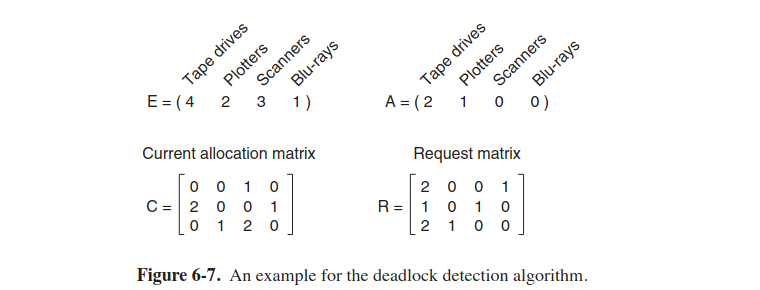

## 6.1 Resources
- every OS gives a process a temporarily **exclusive** grant to a recourse
- recourse is either a hardware device or a piece of data
- preemptable recourse is one that can be taken away from a process with no harm (e.g, memory can be taken from a process)
- it depends on the architecture: memory on PC is preemptable because pages can be swapped to the disk, but on smartphone that does not support paging, memory is not preempted

## 6.2-6.4 Intro to deadlocks
four conditions must hold for a recourse deadlock occuring:  
1. mutex condition: each recourse is either currently assigned to exactly one process or is available
2. hold-and-wait condition: processes that hold resourses can request new recourses
3. no-preemption condition: processes cannot release recourses on demand, recourses have to be explicitly released by the process holding them
4. circular-wait condition: there must a be circular list of two or more processes, each of which is waiting for a recourse held by the next process.

four strategies to deal with deadlocks:  
1. the ostrich algorithm
2. deadlock detection and recovery: for one recourse of each type just draw a graph and traverse it: if you found a cycle, that means there's a deadlock; for multiple recourses of each type, make 4 matrices and compare each row in R with A:
  
We have detected a deadlock, what's next? Firstly, we can try to use **recovery through preemption** (take a recourse away from its current owner and give it to another process), but this highly depends on the nature of the process. Secondly, we can use **recovery through rollback (откат)** (use checkpoints to record processes' states). Thirdly, we can use **recovery through killing processes**: we can kill either processes in a cycle or we can kill a process outside cycle that takes many recourses and can be killed without no ill effects (e.g, compilation).
3. dynamic avoidance by careful recourse allocation (Banker's algorithm). but in practice, it is not used, because we do not know the number of used recourses by a given process.
4. in real OSes we use **deadlock prevention**. we try to attack one of four conditions of deadlocks. 

- attacking the mutex condition is useless (but we can create a printer daemon for example and all processes will call a printer daemon, not the printer itself). so, avoid assigning a recourse unless necessary and make sure that as few processes as possible claim the recourse
- attacking hold-and-wait condition is promising: we can make all processes request all recourses before they start execution (problem is that few processes know amount of recourses they need)
- attacking non-preemption (we can try to force to take away recourses from processes)
- attacking circular wait (order recourses numerically, a process cannot use recourses that is lower than the current one used, drawback is no ordering of recourses satisfies everyone)

## 6.7 Other issues
- two-phase locking: first phase is process trying to lock all recourses it needs, second phase is process does everything it needs with them. if during the first phase it cannot lock all recourses, it repeats until it can (this method is not applicable real time OS)
- communication deadlocks (type of cooperating sync in contrast to competition sync with recourse deadlocks) (occur in networks): we use timeouts to solve communication deadlocks, we set timer and if the timer goes off and there is no reply, we send the message again.
- livelock:  states of the processes involved in the livelock constantly change with regard to one another, none progressing (processes are not blocked)
- starvation (remember analogy with printer and huge files): possible solution FCFS (first come, first served)